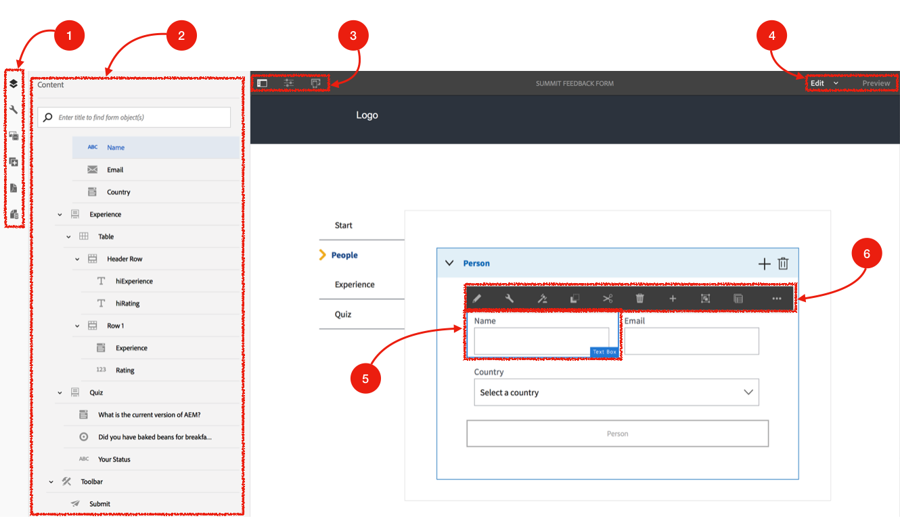

# Exercise 02 - Understand the UI

## Objective
This exercise is to help you understand the UI of Adobe Experience Manager Forms editor. You will use the UI throughout the course of this lab.

Below a screenshot of the final form, you will build as part of this labs, annotated to indicate the various UI elements.

## Sidebar
The sidebar consists of:

1. The toolbar to invoke the various panels of the sidebar

2. The panel itself.
The toolbar allows you to switch the panel in the sidebar to (from top to bottom):
* *Content*: shows you the content structure of the form
* *Properties*: shows the properties panel of a selected form object
* *Assets*: shows the assets you can use to build your form, e.g. images, form fragments, etc...
* *Components*: shows the components you can use to build your form, e.g. text box, button, panel, etc...
* *Document of Record*: shows you the configuration of a document of record for the form
* *Data Sources*: shows the data source associated with your form

## Page Toolbar
The page toolbar consists of:

3. On the left, a toolbar consisting of buttons to (from left to right):
* **Toggle Side Panel**
* Open  **Page Information**
* Invoke the **Emulator**

4. On the right, buttons to switch the user interface (from left to right):
* **Edit**, a dropdown listbox to invoke different editors
* **Preview**, a button to switch the UI in preview mode

## Component and Component Toolbar
In the AEM Forms UI, you can select a component in the form.

5. In our screenshot, the *Text Box* component is selected

6. As soon as a component is selected, its appropriate toolbar will be shown. In this case the following buttons are available on the component toolbar (from left to right):
* **Edit**: To edit the component editable element inline (e.g. a caption on a text box)
* **Configure**: To configure the component; when clicking this button the sidebar will automatically switch to the *Properties* panel
* **Edit Rules**: This will open the rule editor for the specific component (more on this later)
* **Copy**: To copy the selected component
* **Cut**: To cut the selected component
* **Delete**: To delete the selected component
* **Insert Component**: To insert a new component in the form
* **Group**: To group components
* **Parent**: To jump from the selected component to its parent component (e.g. from a text box to the panel containing the text box)
* **More**: To reveal more actions

## Next
* Continue to [Exercise 03](../exercise03/)

