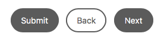
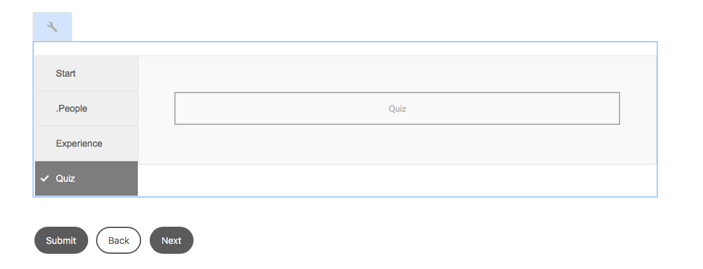

# Exercise 03 - Configure your form

## Objective
In this exercise you will learn how configure the layout of your form, and how to add subpanels and a toolbar to your form.

## Configure layout
You configure your form's layout you will configuring the Root Panel layout.
1. Select the **Root Panel** in the *Content* sidebar, or by selecting the **Root Panel** component in the form itself.
2. Open the properties for the *Root Panel* by clicking on the **Configure** button on the component toolbar. Alternatively, you can click on the wrench icon in the *Properties* pane, when you hover over the *Root Panel* entry in that pane.
3. In the *Properties* for the *Root Panel* select **Tabs on Left** from the *Panel Layout* dropdown listbox.
4. Click on the **√** at the top of the Properties pane to confirm your change of the properties. For the remainder of this lab, remember that you always have to confirm changes to properties by clicking this **√** button.

## Add toolbar
We will now add a toolbar to our form.
1. Switch to *Content* pane in the sidebar by clicking on **Content**.
2. Select the **Form Container** element.
3. In the component toolbar, click on the **... (More)** button and from the menu, select **Add toolbar**. A toolbar will be added to bottom of your form. You will also see a *Toolbar* element appearing in the *Content* pane, below the *Root Panel*.
4. Select the newly added toolbar by either clicking the **Toolbar** element in the *Content* pane, or by selecting the **Toolbar for Panel: guide1** component in the form.
5. Click on the **+** button. In the *Insert New Component* dialog, select **Next Button**.
6. Repeat steps 4 and 5 for adding a *Previous* and a *Submit* buttom to the toolbar.
Your toolbar should now look like below.\

## Adding child panels
We will now add multiple child panels to our form. Child panels allow you to structure your form both hierarchically as well as visually. In our example, adding child panels will actually add tabs to the form because of our layout configuration we die earlier.
1. Select **Root Panel** (you should by now, know how to select the Root Panel, otherwise re-read the section Configure Layout above).
2. Click the **...** button on the component's toolbar.
3. Select **Add Child Panel** from the dropdown menu. 
4. In the *Add Child Panel* dialog, specify **Start** for the *Title* and **start** for the *Name*.
5. Click **√** button to confirm parameters and close dialog.
6. Repeat steps 1-5 to add three more child panels with the following parameters:
   1. *Title*: **People**, *Name*: **people**
   2. *Title*: **Experience**, *Name*: **experience**
   3. *Title*: **Quiz**, *Name*: **quiz**
Your form should now look like below\

See this Youtube [video](https://youtu.be/F7PUK7_ZGcE) for a replay of above exercise.

## Next
* Continue to [Exercise 04](../exercise04/)
