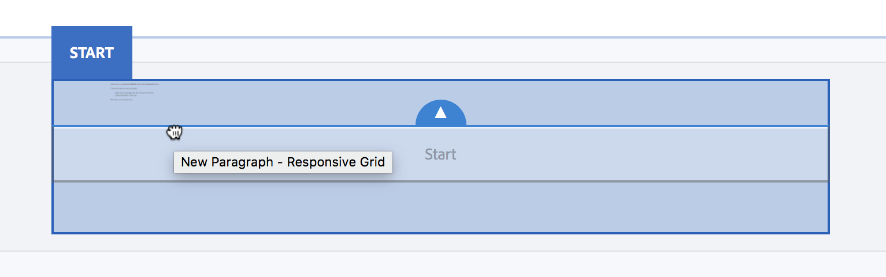

# Exercise 04 - Add content using form fragments

## Objective
In this section you will learn how to add content to your form by using so-called form fragments.

## Add content fragment
We will use a predefined adaptive form fragment to define the Start section. Adaptive form fragments are reusable form components that you can create once and then use in multiple forms. This allows you to quickly and easily insert common form elements in a form. Think for example an address block, consisting of street, postal code and city. You can define them in an address form fragment that you can then use across many forms.
For our form, we have prepared an introduction text and saved that in a form fragment which we will use in our Start section.
1. Select the **Start** component in *Content* pane.
2. Select **Assets** to open the *Assets* pane.
3. Select **Adaptive Form Fragments** from the *Images* dropdown listbox.
4. Drag and drop the **Welcome to TL25** adaptive form framgment from the *Assets* pane and drop it onto the *Start* component in the form, as in the screenshot below.\

See this Youtube [video](https://youtu.be/UfkWNV76gTk) for a replay of above exercise.

## Next
* Continue to [Exercise 05](../exercise05/)
