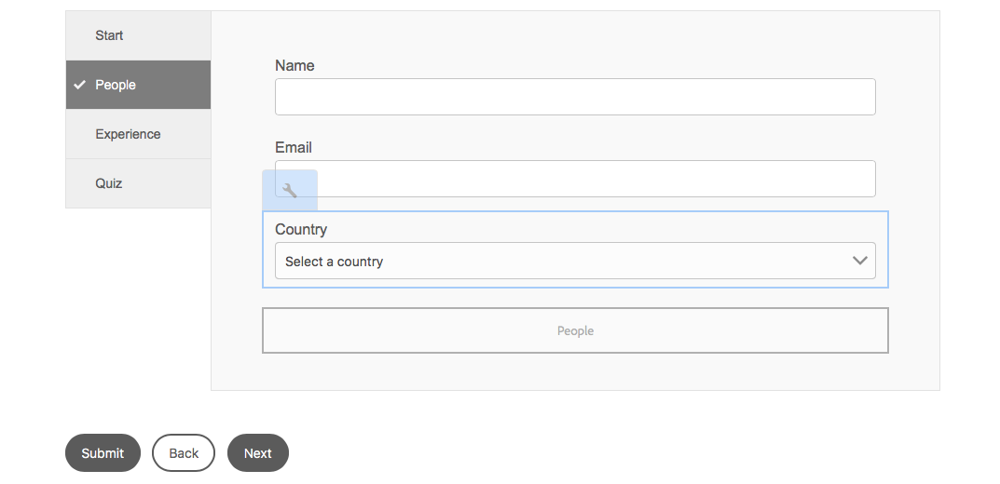
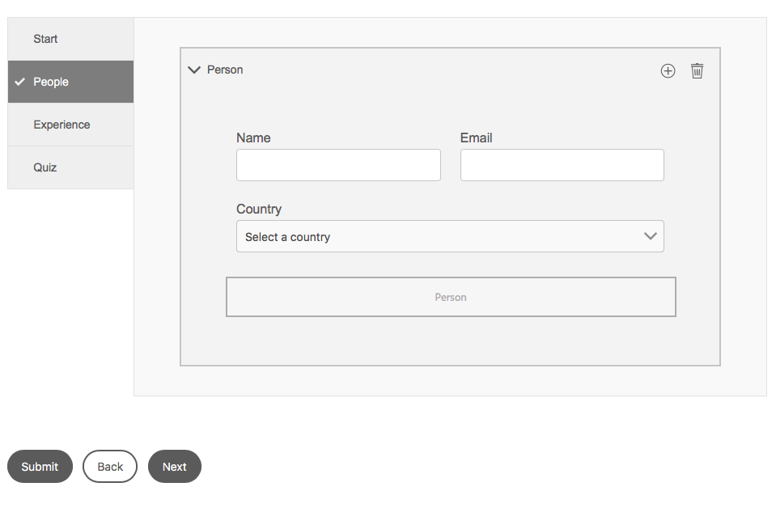

# Exercise 05 - Add content using components

## Objective
In this exercise you will learn how to add content to the form using components and how to configure these components. Also you will learn how to preview your form.

## Add components to the form
1. Click **Content** and then select the **People** element in the list to ensure the **People** section in the form is selected.
2. Click **Component** to open the *Components* pane. You will see a list of all components you can use in your form.
3. Drag and drop a **Text Box** component on the *People* component in the form.
4. Drag and drop an **Email** component below the *Text Box* component on the form.
5. Drag and drop a **Drop-down List** component below the *Email* component on the form.

## Configure the components
1. Select the **Text Box** component and click on **Properties** in the toolbar. In the *Properties* pane:
   1. Enter **tbName** as *Name*.\
   The name of a component is important as you can use it to refer to it in rules and more advanced scripting. It is a good practice to identify your component with a somewhat descriptive name. In this lab we will use two characters to identify the type of component (e.g. `tb` for text box, `dl` for drop-down list, etc.), but you're completely free in choosing your own naming convention.
   2. Enter **Name** as *Title*.
   3. Click on **√** to confirm.
2. Select the **Email** component and click on **Properties** in the toolbar. In the *Properties* pane:
   1. Enter **ebEmail** as *Name*.
   2. Scroll down and click on **Patterns**. \
   You will see this email component has a specific validation pattern defined (using a regular expression `^(([^<>()\[\]\\.,;:\s@"]+(\.[^<>()\[\]\\.,;:\s@"]+)*)|(".+"))@((\[[0-9]{1,3}\.[0-9]{1,3}\.[0-9]{1,3}\.[0-9]{1,3}])|(([a-zA-Z\-0-9]+\.)+[a-zA-Z]{2,}))$`) to ensure a valid email is provided. Don't worry, you do not have to remember this. The email component is nothing else than a more sophisticated text box component with this additional validation already applied for you.
   3. Click on **√** to confirm.
3. Select the **Drop-down List** component and click on **Properties** in the toolbar. In the *Properties* pane:
   1. Enter **dlCountry** as *Name*.
   2. Enter **Country** as *Title*.
   3. Click on **Add** in the *Items* section of the *Properties* pane and in the text box that appears, type `United Kingdom`. 
   4. Repeat this to add more countries, e.g. `Germany`, `France`, `Italy`, `Spain`, etc.
   5. Enter `Select a country` in the *Placeholder Text* field.
   6. Click on **√** to confirm.
Your form should now look like as in the screenshot below:\

## Modify the layout
As you can see, the *Name* and *Email* text box takes the whole width of the form. If we want to position them horizontally next to each other we can do so by positioning them in a (sub-)panel. To do so:
1. Go back to the *Components* pane by clicking on **Components**.
2. Drag a **Panel** component and drop it in between the *Email* and *Country* component on the form.
3. Switch to the *Content* pane by clicking on **Content**.
4. Drag **Country** component in the *Content* pane and drop it in that same pane on top of the **Section** component.
4. Drag **Email** component in the *Content* pane and drop it in that same pane on top of the **Section** component.
5. Drag **Name** component in the *Content* pane and drop it in that same pane on top of the **Section** component.
6. Select **Section** entry in the *Content* pane and while hovering, click on the **Configure** (wrench) icon on the right of that selected entry. This will open the *Properties* pane.
7. In the *Properties* pane, select **2** in the *Number of Columns* dropdown listbox.
8. Click on **√** to confirm changes.
9. Select *Country* component in the *Content* pane and click on the **Configure** button in the toolbar.
10. In the *Properties* pane, select **2** from the *Colspan* dropdown listbox.

*Name* and *Email* will now be positioned next to each other. However, when you make your browser window smaller, you will see that the form will behave responsive and position both fields underneath of each other. *Country* on the other hand will be displayed across the whole width of the panel, despite that the panel is configured to consist of two columns.

## Allow for multiple persons
Assuming you're not alone behind the workstation right now, we would like to extend this feedback form so both persons can provide their name, email and country. Rather than copying the steps above, we can set up the form to allow for repeating entries.
1. Go back to the *Content* pane by clicking on **Content**
2. Select the **Section** component. Click on the **Configure** button in the *Section* component's toolbar.
3. Rename panel *Name* to **pnlPerson**.
4. Set *Title* to **Person**.
5. Set *Repeat Settings - Minimum* to **1** and *Repeat Settings - Maximum* to **2**.
6. Click **√** to confirm.
7. Select the **People** component. Click on the **Configure** button in the *People* component's toolbar.
8. Select **Accordion** from the *Layout* dropdown list.
9. Click **√** to confirm.

Your form should now look like the screenshot below:\

## Preview the form
At any time you can preview a form to experience how it looks, feels and behaves for the end-user. To do so:
1. Click on **Preview** in the Page toolbar.
2. Click on the **People** tab on the left.
3. Click on the **+** icon in the **Person** panel to add another *Person* panel
As you can try out, you can delete the additional or initial *Person* panel as well.

See this Youtube [video](https://youtu.be/z9QeMF0QGy4) for a replay of above exercises.

## Next
* Continue to [Exercise 06](../exercise06/)
