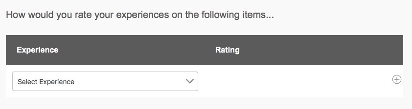

# Exercise 06 - Use complex components

## Objective
In this exercise you will learn how to add a more complex component, like a table, to a form and how to configure that table component.

## Add a table
We will first add a table to our form (pretty straightforward) and then configure it properly.
1. In case you're still in *Preview* mode, return to *Edit* mode by clicking on **Edit**.
1. In your form select the **Experience** tab on the left of the form, or select the **Experience** entry in the *Content* pane.
2. Switch to **Components** pane, and drag a **Table** component onto the *Experience* component in the form.
That's all there is to add a table to your form.

## Configure the table
We want the table to contain a dynamic amount of rows indicating your types of experience and rating with each of them. To enable the table to do this, you need to do the following:
1. Switch back to **Content** pane. Select **Row 2** and in the component's toolbar, click on **...** and then on **Delete Row**. In the *Delete Row* confirmation dialog, confirm by clicking **Yes**.\
This will delete the second row from the table. Our table will have dynamic rows (much alike the dynamic panel we saw in the previous exercise) and each row entry will be based on what we define for the first row.
2. Select the textbox in *Row 1* by clicking that cell in the table in the form, or by selecting first **Text Box** underneath *Row 1* in the *Content* pane.
3. On the component's toolbar, click on the **...** and then select **Replace**. In the *Replace Component* dialog, select **Drop-down List**. This will replace the component. By default, a table is created with text box components in each of the cell and this is how we can change this.
4. Select the drop-down list component and click on **Properties**. In the *Properties* pane, enter `dlExperience` for *Name* and `Experience` for *Title*. Note however that the title for this component is hidden by default.
5. Add the following items to the drop-down list: `Knowledge`, `Presentation`, `London Weather` and `London Food`. 
6. Enter `Select experience` in the *Placeholder Text*.
7. Click on **√** to confirm.
8. Select the second text box to the right of our *Select Experience* dropdown list on the first row of the table.
9. Again, select the *...*, followed by **Replace** and select **Numeric Box** from the dialog.
10. Reselect the *Numeric Box* and click on **Configure**.
11. In the *Properties* pane, enter `nbRating` for *Name* and `Rating`for *Title*. 
12. Scroll down and enter `2` for *Maximum Number of Digits*, `1` for *Minimum Value* and `10` for *Maximum Value*.
13. Click on **√** to confirm.

We have now configured the row to allow you to select the experience you want to rate and with what rating. Next step is to allow for multiple of those rows. To do this:
1. Switch to *Content* pane by clicking on **Content**.
2. Select **Row 1** and in the component's toolbar, click on **Configure**.
3. In the *Properties* pane, rename *Name* to `rwExperience` with *Title* `Experience`.
4. Enter `1` for *Minimum Count* and `4` for *Maximum Count*.
5. Click on **√** to confirm.

We want the table to be a bit more descriptive for first time users. To do so:
1. Click on **Header** in the table header (header of left column). This will select the *headerItem* in the *Content* pane. Click on the **Pencil** button (first on the left) in the component's toolbar and change the text inline to `Experience`. When finished, click the **√** button on the editor's toolbar (at the left).
2. Do the same with the right column header; rename this to `Rating`.
Finally we will modify the *Experience* panel containing the table with some description to guide the user. To do so:
3. Switch to *Content* pane by clicking on **Content**.
4. Select the **Experience** entry for the panel (not for the column header!) and click on the **Configure** button in the entry.
5. Enter the following text in *Description*: `How would you rate your experiences on the following items...`.
6. Click on **√** to confirm.

## Preview your Experience panel
To see if all is working ok:
1. Click on **Preview**. Click on the **Experience** tab. Your pane should look like:\

2. See if you can add / delete rows to the table.

See this Youtube [video](https://youtu.be/xoCM7cKuZCU) for a replay of above exercises.

## Next
* Continue to [Exercise 07](../exercise07/)
