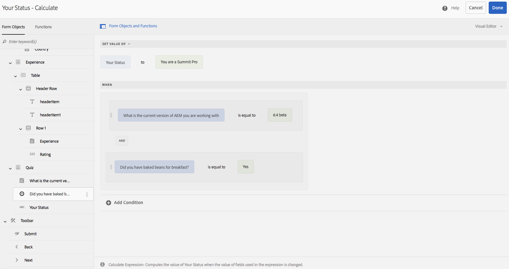
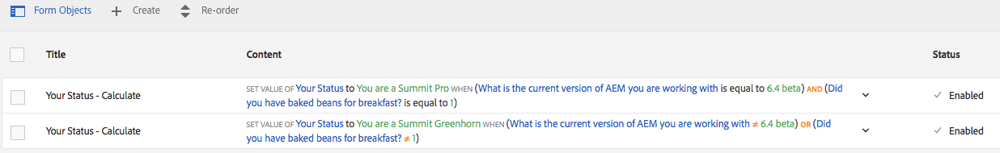

# Exercise 07 - Add rules

## Objective
In this exercise you will learn how to build logic in your form using rules and the visual rule editor.

## Modify the panel
We will first add the necessary fields to the Quiz panel. To do so:
1. Switch back to *Edit* mode if you're still in *Preview* mode.
1. Select the **Quiz** panel in the form.
2. Switch to the **Component** pane in the sidebar.
3. Add a drop-down list component to the form. Configure it as follows:
   1. *Name*: `dlAEMVersion`.
   2. *Title*: `What is the current version of AEM you are working with?`.
   3. *Placeholder Text*: `Select version`.
   4. Add `6.1`, `6.2`, `6.3`, `6.4 beta` as *Items*.
4. Click on **√** to confirm.
5. Add **Radio Button** component below the *Drop-down list* component.
6. Configure the component as follows:
   1. *Name*: `rbBakedBeans`.
   2. *Title*: `Did you have baked beans for breakfast?`.
   3. Modify the two *Items* so they read `0=No` and ` 1=Yes`.
7. Click in **√** to confirm.
8. Add a **Text Box** component underneath the *Did you have baked beans for breakfast?* radio button group. And configure it as follows:
   1. *Name*: `tbStatus`.
   2. *Title*: `Your Status`.
   3. *Default Value*: `...`.
   4. Check the *Disable Object* option to prevent end user to make changes to this text box.
9. Click on **√** to confirm.

## Add a rule
Now we will add a rule to the panel that will automatically change the text in the *Your Status* text box.
1. Select the **Your Status** text box.
2. Click on the **Edit Rules** button to open the *Rule Editor*.
3. Click on **+ Create** to create a new rule.
4. In the *Your Status - When* screen, select from the *WHEN* drop-down list, **Set Value of**.
5. Select from the *Select Option*, **Enter a String** and type `You are a real Summit Pro`.
6. Click on **Add Condition**. This will reveal the *When* area allowing you to define when the *Your Status* text box should have the value you defined at step 5.
7. Click on **Form Objects and Functions** at the top of the *Your Status - Calculate* screen. This will reveal a side pane with the *Form Objects*.
8. Drag the **What is the current...** drop-down list entry from *Form Objects* and drop it on the left *Drop object or select here* underneath *When*.
9. From the *Select Operator* drop-down list, select **is equal to**.
10. Click on the right *Drop object or select here* button and then:
   1. Click on **Form Object**.
   2. Click on **String**.
   3. Click on **Enter a String** drop-down list.
   4. Select **6.4 beta**.
11. Based on the above steps, add an additional condition where you use the *Did you have baked...* component and verify whether it is equal to **Yes**.
12. Ensure the *Select Operator* in between the two conditions is set to **And**.\
Your rule editor should look like the screenshot below:\

13. Click **Done** to close the *Your Status - Calculate* rule editor.

## Add another rule
Repeat the above steps to create an additional rule that will set the *Your Status* component to *You are a Summit Greenhorn* when the current AEM version you selected is not equal to 6.4 or you did not have baked beans for breakfast.
When you've done, the *Rule Editor - Your Status* should look like the screenshot below:

Click **Close** to close the Rule Editor. Then preview your form and see if it behaves properly and shows you the right status based on the selections you make in the *Quiz* panel.

See this Youtube [video](https://youtu.be/OLIMICi52a4) for a replay of above exercises.

## Next
* Continue to [Exercise 08](../exercise08/)
