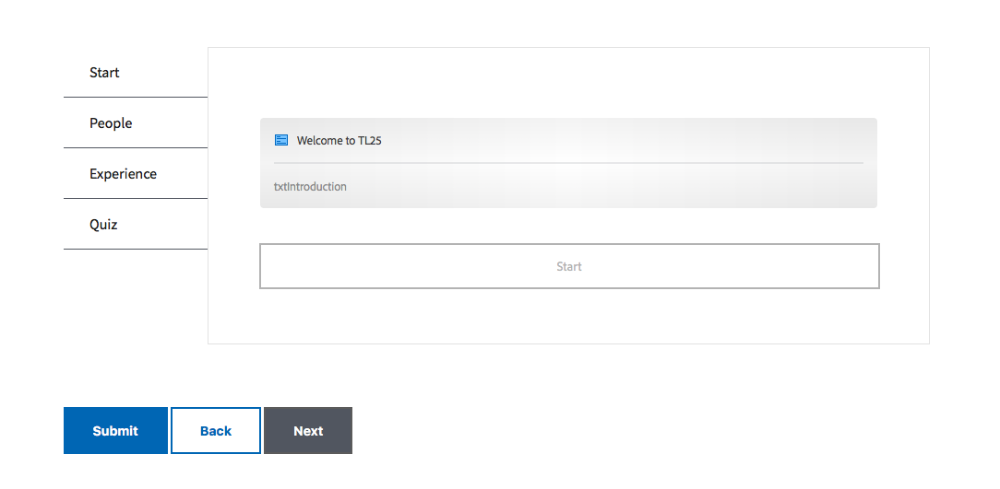

# Exercise 08 - Apply a theme and generate a DoR

## Objective
In this lesson you will learn how to apply a different theme to your form and generate a document of record (DOR) for your form.

## Generate a document of record
We can create an automatic document of record (DoR) for our form. A DoR is actually a PDF capture of the data submitted with the form. To do so:
1. Open a new tab/window in your browser and go to http://localhost:4502/aem/forms.html/content/dam/formsanddocuments
2. Hover over the *Summit Feedback Form* and click on the **√**.
3. Click on **Properties** in the toolbar.
4. In the *summit-feedback-form* properties dialog, select the **Form Model** tab.
5. In the *Form Modal* tab, select the **Generate Document of Record** radio button.
6. Click **Save & Close**.

## Apply a different theme
When we started our lab, we created the initial form based on a theme. A theme is a collection of styles which control the look and feel of the form. At any time we can select a different theme and apply this to our form. To do so:
1. Go back to your form in the browser. If not open, open it by going to http://localhost:4502/aem/forms.html/content/dam/formsanddocuments, selecting the *Submit Feedback Form* and clicking on the **Edit** button.
2. Click on **Content** to ensure the *Content* pane is available.
3. In the *Content* pane, select **Forms Container** entry.
4. Click on **Configure** button (either in the pane or in the form).
5. In the *Properties* pane, select **SummitLab** as the *Adaptive Form Theme*.
6. Click on **√** to confirm.

Your form should now look like the screenshot below:\

It goes beyond this lab, but AEM Forms includes functionality to create and modify a theme using a visual UI, rather than having to learn CSS.

See this Youtube [video](https://youtu.be/tkU-qR-RTzY) for a replay of above exercise.

## Next
* Continue to [Exercise 09](../exercise09/)
