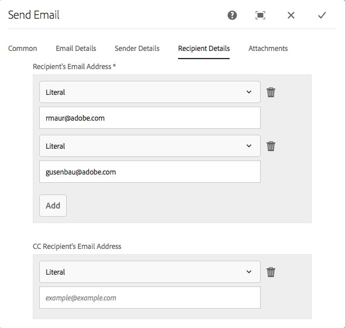

# Exercise 09 - Application submission

## Objective
In this section you will learn how to inspect and assign a workflow to a form that will be used to further process a form after submission.

## Define Submission
To submit a form you need to define a submission action for the form. To do so:
1. Go back to your form in the browser. If not open, open it by going to http://localhost:4502/aem/forms.html/content/dam/formsanddocuments, selecting the *Submit Feedback Form* and clicking on the **Edit** button.
2. Click on **Content** to ensure the *Content* pane is available.
3. In the *Content* pane, select **Forms Container** entry.
4. Click on **Configure** button (either in the pane or in the form).
5. In the *Properties* pane, select unfold the **Submission** area.
6. Select **Invoke an AEM workflow** from the *Submit Action* drop-down list.
7. Select **Email DOR** from the *Workflow Model* drop-down list.
8. Enter **data.xml** in the *Data File Path* text box.
9. Enter **DOR.pdf** in the *Document of Record Path* text box.
10. Click on **√** to confirm.

## Workflows
Adobe Experience Manager does provide workflow functionality. A lot of the workflow functionality is built around managing of content but there is a dedicated set of workflow activities that can handle a form submission. For our lab we have built a small example of such a workflow - Email DOR, which we have now set up for our form, and we are going to inspect this workflow. To do so:
1. Go to the main screen of AEM by pointing your browser to http://localhost:4502.
2. Click on the **Tool** button (the one with the hammer) in the left rail.
3. Click on **Workflow** in the left rail.
4. Click on **Models** in the *Tools* pane.
5. Click on **Email DOR** tile and select the **√** circle. When active, select **Edit** from the toolbar. 

This will open the workflow editor for *EMAIL DOR*. As you can see the current workflow is straightforward: it will generate a document of record and then email the PDF. In the next steps we will configure the workflow. To do so:
1. Click on the **Generate Document of Record** activity and then click on the **Configure** button in the toolbar.
2. In the *Generate Document of Record* dialog, ensure you change the value of *Adaptive Form Path* to `/content/dam/formsanddocuments/summit-feedback-form`.
3. Leave all other values unchanged and click on **√** to close the dialog.
4. Back in the workflow editor, double click on the **Send Email** activity.
5. Inspect the various tabs of the dialog. Especially in the *Attachments* tab you see how this activity takes the generated document of record from the previous activity and adds this as an attachment to the email.
5. Click on the **Recipient Detail** tab and fill in your *Recipient's Email Address*. If you both want to receive the DOR, ensure you fill in two email addresses, as shown in screenshot below:\n

6. Click on **√** to confirm.
7. Back in the *EMAIL DOR* editor, click on the **Sync** button to sync the workflow with the workflow engine.

See this Youtube [video](https://youtu.be/jzda5niSWM0) for a replay of above exercise.

## Next
* Continue to [Exercise 10](../exercise10/)
